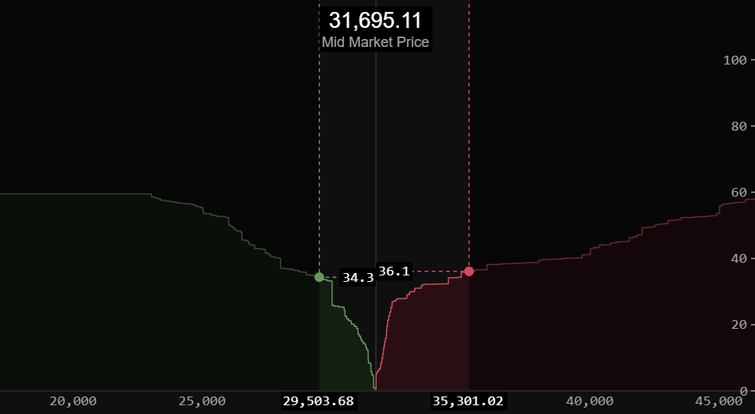

[](https://github.com/vegaprotocol/pennant/actions/workflows/test.yml)
[](https://github.com/vegaprotocol/pennant/blob/main/LICENSE)
[](https://npmjs.com/package/pennant/)

<br />
<p align="center">
  <a href="https://github.com/vegaprotocol/pennant">
    
  </a>

  <h3 align="center">Pennant</h3>

  <p align="center">
    A React component library for visualising historical and streaming financial market data.
  </p>

  <p align="center">
    
  </p>

  <p align="center">
    
  </p>
  
  <p align="center">
    <a href="https://pennant.vega.xyz">View Demo</a>
    ·
    <a href="https://github.com/vegaprotocol/pennant/issues">Report Bug</a>
    ·
    <a href="https://github.com/vegaprotocol/pennant/issues">Request Feature</a>
  </p>
</p>

<details open="open">
  <summary>Table of Contents</summary>
  <ol>
    <li>
      <a href="#about-the-project">About The Project</a>
    </li>
    <li>
      <a href="#getting-started">Getting Started</a>
      <ul>
        <li><a href="#prerequisites">Prerequisites</a></li>
        <li><a href="#installation">Installation</a></li>
      </ul>
    </li>
    <li><a href="#usage">Usage</a></li>
    <li><a href="#contributing">Contributing</a></li>
    <li><a href="#license">License</a></li>
  </ol>
</details>

## About The Project

A React chart component visualising historical and streaming financial market data. Built for the Vega platform but can be embedded in any application.

## Getting Started

Pennant is available from npm.

### Prerequisites

Pennant has `react` and `react-dom` as peer dependencies.

```sh
yarn add react react-dom
```

### Installation

```sh
yarn add pennant
```

## Usage

```jsx
import React from "react";
import { CandlestickChart } from "pennant";

const dataSource = new DataSource();
const options = {
  chartType: "candle",
  studies: [],
  overlays: [],
};

export const App = () => (
  <CandlestickChart dataSource={dataSource} options={options} interval="I1M" />
);
```

The minimum props required are:

- dataSource
- options
- interval

### Styling pennant

You may customize the styling of pennant components by overriding the default CSS variables.

```css
/**
 * You can override the default pennant variables.
 * Note: this is not a complete list of --pennant- variables.
 */
:root {
  --pennant-color-success: #26ff8a;
  --pennant-color-danger: #ff261a;
}
```

## Data

Pennant displays financial data using a DataSource object you pass as a prop to the React CandlestickChart component. This object must implement the DataSource interface, and typically takes the form of a class.

It provides a set of methods such as `query` and `subscribe` which will be called by the chart to get historical and streaming data respectively.

Several reference implementations are provided.

## Contributing

### Development

We use [Storybook](https://storybook.js.org/).

```sh
yarn storybook
```

Open [http://localhost:6006](http://localhost:6006) to view in the browser.

We try our best to follow the [Conventional Commits](https://www.conventionalcommits.org/) specification. This lets use [standard-version](https://github.com/conventional-changelog/standard-version) for semantic versioning and CHANGELOG generation.

### Building

To build the library run

```sh
yarn build
```

The output can be found in the `dist` directory.

### Testing

To run the tests

```sh
yarn test
```

### Releasing a new version

We use [standard-version](https://github.com/conventional-changelog/standard-version) for semantic versioning and CHANGELOG generation.
As long as your git commit messages are conventional and accurate, you no longer need to specify the semver type. It will be calculated for you.
An npm script is provided for convenience.

```sh
yarn release
```

If successful you can push up the new commit and tag with

```sh
git push --follow-tags origin main
```

To release as a pre-release use the flag `--prerelease`.

```sh
yarn release -- --prerelease alpha --release-as minor
```

### Adding a new chart type

Add the new chart type in `chart-types.ts`. Add a new case in `helpers-spec.ts` which specifies how to draw the new chart type.

## License

Pennant is available under the [MIT license](https://opensource.org/licenses/MIT).
