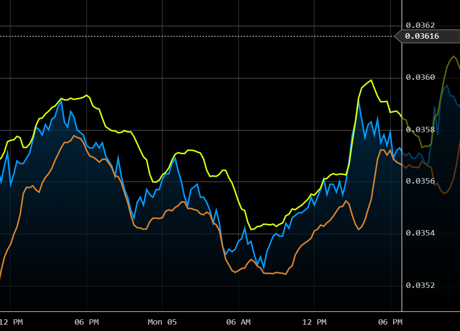

[](https://github.com/vegaprotocol/pennant/actions/workflows/test.yml)
[](https://github.com/vegaprotocol/pennant/blob/main/LICENSE)
[](https://npmjs.com/package/pennant/)
[](https://app.netlify.com/sites/pennant/deploys)

<br />
<p align="center">
  <a href="https://github.com/vegaprotocol/pennant">
    
  </a>

  <h3 align="center">Pennant</h3>

  <p align="center">
    A React component library for visualising financial data.
  </p>

  <p align="center">
    
  </p>
  
  <p align="center">
    <a href="https://pennant.netlify.app/">View Demo</a>
    ·
    <a href="https://github.com/vegaprotocol/pennant/issues">Report Bug</a>
    ·
    <a href="https://github.com/vegaprotocol/pennant/issues">Request Feature</a>
  </p>
</p>

<details open="open">
  <summary>Table of Contents</summary>
  <ol>
    <li>
      <a href="#about-the-project">About The Project</a>
    </li>
    <li>
      <a href="#getting-started">Getting Started</a>
      <ul>
        <li><a href="#prerequisites">Prerequisites</a></li>
        <li><a href="#installation">Installation</a></li>
      </ul>
    </li>
    <li><a href="#usage">Usage</a></li>
    <li><a href="#contributing">Contributing</a></li>
    <li><a href="#license">License</a></li>
  </ol>
</details>

## About The Project

React components for viewing financial data. Built for the Vega platform.

## Getting Started

Pennant is available from npm.

### Prerequisites

Pennant has `react` and `react-dom` as peer dependencies.

```sh
yarn add react react-dom
```

### Installation

```sh
yarn add pennant
```

## Usage

```jsx
import React from "react";
import { Chart } from "pennant";

const dataSource = new ExampleDataSource();

export const App = () => {
  const [interval, setInterval] = React.useState("I1M");

  return (
    <Chart
      dataSource={dataSource}
      interval={interval}
      onSetInterval={setInterval}
    />
  );
};
```

## Contributing

### Development

We use [Storybook](https://storybook.js.org/).

```sh
yarn storybook
```

Open [http://localhost:6006](http://localhost:6006) to view in the browser.

### Building

To build the library run

```sh
yarn build
```

The output can be found in the `dist` directory.

### Testing

To run the tests

```sh
yarn test
```

## License

Pennant is available under the [MIT license](https://opensource.org/licenses/MIT).
